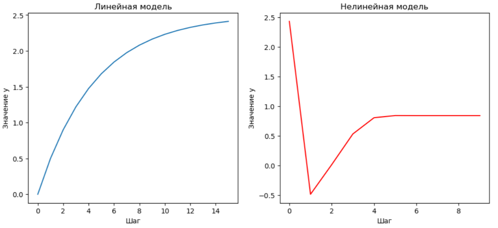

<p style="text-align: center;">Министерство образования Республики Беларусь</p>
<p style="text-align: center;">Учреждение образования</p>
<p style="text-align: center;">“Брестский Государственный технический университет”</p>
<p style="text-align: center;">Кафедра ИИТ</p>
<div style="margin-bottom: 10em;"></div>
<p style="text-align: center;">Лабораторная работа №1</p>
<p style="text-align: center;">По дисциплине “Общая теория интеллектуальных систем”</p>
<p style="text-align: center;">Тема: “Моделирования температуры объекта”</p>
<div style="margin-bottom: 10em;"></div>
<p style="text-align: right;">Выполнила:</p>
<p style="text-align: right;">Студентка 2 курса</p>
<p style="text-align: right;">Группы ИИ-24</p>
<p style="text-align: right;">Алешко А.В.</p>
<p style="text-align: right;">Проверил:</p>
<p style="text-align: right;">Иванюк Д. С.</p>
<div style="margin-bottom: 10em;"></div>
<p style="text-align: center;">Брест 2023</p>

---

# Общее задание #
1. Написать отчет по выполненной лабораторной работе №1 в .md формате (readme.md) и с помощью запроса на внесение изменений (**pull request**) разместить его в следующем каталоге: **trunk\ii0xxyy\task_01\doc** (где **xx** - номер группы, **yy** - номер студента, например **ii02302**).
2. Исходный код написанной программы разместить в каталоге: **trunk\ii0xxyy\task_01\src**.

## Task 1. Modeling controlled object ##
Let's get some object to be controlled. We want to control its temperature, which can be described by this differential equation:

$$\Large\frac{dy(\tau)}{d\tau}=\frac{u(\tau)}{C}+\frac{Y_0-y(\tau)}{RC} $$ (1)

where $\tau$ – time; $y(\tau)$ – input temperature; $u(\tau)$ – input warm; $Y_0$ – room temperature; $C,RC$ – some constants.

After transformation we get these linear (2) and nonlinear (3) models:

$$\Large y_{\tau+1}=ay_{\tau}+bu_{\tau}$$ (2)
$$\Large y_{\tau+1}=ay_{\tau}-by_{\tau-1}^2+cu_{\tau}+d\sin(u_{\tau-1})$$ (3)

where $\tau$ – time discrete moments ($1,2,3{\dots}n$); $a,b,c,d$ – some constants.

Task is to write program (**С++**), which simulates this object temperature.


---
# Выполнение задания #
```C++
#include <iostream>
#include <cmath>
#include <vector>

std::vector<double> y_lin;
std::vector<double> y_nonlin;

void linear_model(double a, double b, double y, double u, int i, int t) {
    if (i <= t) {
        std::cout << y << std::endl;
        y_lin.push_back(y);
        double y_2 = a * y + b * u;
        linear_model(a, b, y_2, u, i + 1, t);
    } else {
        std::cout << "END" << std::endl;
    }
}

void nonlinear_model(double a, double b, double c, double d, double y, double y_prev, double u, double u_prev, int i, int t) {
    if (i == 1) {
        std::cout << y << std::endl;
        y_nonlin.push_back(y);
        double y_2 = a * y - b * pow(y_prev, 2) + c * 0 + d * sin(0);
        nonlinear_model(a, b, c, d, y_2, y, u, u, i + 1, t);
    } else if (i <= t) {
        std::cout << y << std::endl;
        y_nonlin.push_back(y);
        double y_2 = a * y - b * pow(y_prev, 2) + c * u + d * sin(u_prev);
        nonlinear_model(a, b, c, d, y_2, y, u, u, i + 1, t);
    } else {
        std::cout << "END" << std::endl;
    }
}

int main() {
    int i = 1;
    double y = 0.0;
    double u = 1.0;
    int t = 10;
    double a = 1.0;
    double b = 0.5;
    double c = 0.001;
    double d = 0.999;

    std::cout << "Linear Model:" << std::endl;
    linear_model(a, b, y, u, i, t);

    std::cout << "Nonlinear Model:" << std::endl;
    nonlinear_model(a, b, c, d, y, y, u, u, i, t);

    std::cout << "linear_model: ";
    for (const auto &val : y_lin) {
        std::cout << val << " ";
    }
    std::cout << std::endl;

    std::cout << "nonlinear_model: ";
    for (const auto &val : y_nonlin) {
        std::cout << val << " ";
    }
    std::cout << std::endl;

    return 0;
}
```     

Вывод программы:

Линейная модель
0
0.4
0.52
0.556
0.5668
0.57004
0.571012
0.571304
0.571391
0.571417
0.571425
0.571428

Нелинейная модель
0
0.520735
0.676956
0.615356
0.522034
0.525881
0.569492
0.580963
0.565296
0.555317

